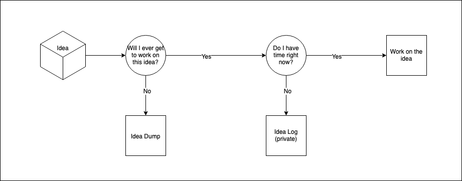

# Ideas

We all have ideas that never see the day of light in your life time. This projects is to gather them and hope that someone else has the time and energy to work on thoses ideas.

I personally have a process through which every idea I have goes through:

## List of Ideas

- [ ] Create a VR Meeting Room Application
- [ ] Generic Fedarated Learning Module for applications to learn behavioural insights about its users
- [ ] Update Passport related information on private blockchain for the government
- [ ] Implement smart cameras to detect unusual activities (As a product)
- [ ] Electric Vehicle Charging Station
- [ ] Unified Ambulance Network
- [ ] Create gRPC Package to reduce development effort while using Node.js
- [ ] Phone for Work (Peer to Peer Voice call feature of the app that works around your schedule)
- [ ] Create P2P database with Open DB Protocol Spec
- [ ] Framework that can be go back-forth from serverless to conventional seamlessly (Reason: Why do we not use serverless? - Lack of upfront commitment)
- [ ] Infrastructure/Platform for listing and using nationally available services through internet
- [ ] Green Cover Initiative with Advertisement point of view
- [ ] Live Guide to beginner in computer science

PS: I am always open to collaboration or discussion on any of the above ideas. Just open a issue or shoot me an email, whatever works for you.
